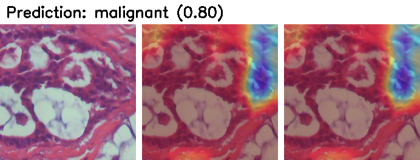

# Moonlight: Enhanced Deep Learning Models for Breast Cancer Detection Using Histopathology Images

## Introduction

**Moonlight** is an advanced deep learning framework designed to improve the accuracy, robustness, and interpretability of breast cancer diagnosis from histopathological images. The project introduces modular CNN architectures, novel loss functions, enhanced data augmentation strategies, and explainability features through Grad-CAM++. 

Moonlight aims to support AI-assisted diagnostics with clinically relevant outcomes and provides researchers with a configurable pipeline for experimentation using the BreaKHis dataset.

## Project Metadata

### Authors
- **Author:** Hassan Jawad Al-Dahneen  
- **Mentor:** Dr. Muzammil Behzad  
- **Affiliation:** King Fahd University of Petroleum and Minerals (KFUPM)

### Project Documents
- **Presentation:** [Project Presentation](/presentation.pptx)
- **Report:** [Moonlight Project Report](Moonlight__Enhanced_Deep_Learning_Models_for_Breast_Cancer_Detection_Using_Histopathology_Image.pdf)

### Reference Paper
- [Hybrid Deep Learning for Breast Cancer Histopathology](https://pmc.ncbi.nlm.nih.gov/articles/PMC11191493/)

### Reference Dataset
- [BreaKHis Dataset on Kaggle](https://www.kaggle.com/datasets/ambarish/breakhis?resource=download)

### Reference Code Repository
- [GitHub Repo](https://github.com/mrdvince/breast_cancer_detection)

### Trained Models
- [Trained Models](https://kfupmedusa-my.sharepoint.com/:f:/g/personal/g200459300_kfupm_edu_sa/Ev38OR9hKBxBiAkIw4Ex2SABhessubCaccGBKy4uRY7b6Q?e=wiW2qt)

## Project Technicalities

## Terminologies

This section explains key technical and domain-specific terms used in the Moonlight project, spanning both deep learning concepts and histopathological breast cancer analysis.

### Deep Learning & Technical Terminologies

- **SimpleCNN:** A basic convolutional neural network used as a baseline model. It contains three convolutional layers, adaptive pooling, and a fully connected classifier. It helps establish reference performance for evaluating enhanced models.
- **ResidualModel:** A CNN architecture that introduces *residual connections* or skip links to allow gradients to flow directly through the network. This improves training stability, especially in deep architectures.
- **EfficientConvModel:** A lightweight architecture that uses **depthwise separable convolutions** to reduce computational load while preserving accuracy. Inspired by MobileNet design principles.
- **UNetClassifier:** A classifier variant of the U-Net architecture. Originally developed for biomedical segmentation, it combines downsampling and upsampling paths to retain spatial features — ideal for capturing microscopic patterns in histology.
- **DenseNet121:** A densely connected convolutional network where each layer receives feature maps from all preceding layers. Enhances feature reuse and gradient propagation.
- **Cross Entropy Loss:** Measures the performance of a classification model by penalizing incorrect predictions based on predicted probabilities.
- **Focal Loss:** Addresses class imbalance by down-weighting well-classified examples, making the model focus on harder, minority-class samples.
- **Perceptual Loss:** Computes the Mean Squared Error (MSE) between predicted softmax probabilities and one-hot encoded labels. Enhances perceptual similarity learning.
- **Composite Loss:** Combines Cross Entropy and Perceptual Loss to improve both class discrimination and semantic alignment.
- **Basic Augmentation:** Includes resizing, normalization, and horizontal flipping. Helps improve generalization with minimal transformation overhead.
- **Advanced Augmentation:** Includes random resized cropping, flipping, rotation, and color jittering. Enhances robustness by simulating real-world variability in histological slide appearance.
- **Grad-CAM / Grad-CAM++:** Gradient-based visual explanation tools that highlight regions of an image most influential to the model's decision. Grad-CAM++ offers better localization and finer heatmaps.
- **AMP (Automatic Mixed Precision):** Speeds up training and reduces memory usage by mixing 16-bit and 32-bit floating-point calculations.
- **StepLR Scheduler:** Decreases the learning rate at regular intervals to promote stable convergence.
- **Early Stopping:** Halts training if the validation loss does not improve after a specified number of epochs, preventing overfitting.

### Medical & Domain-Specific Terminologies

- **Breast Cancer:** A malignant tumor that originates from breast tissue. Early detection through image-based diagnostics significantly improves treatment outcomes.
- **Histopathology:** The microscopic examination of tissue samples to identify signs of disease. In this project, histopathological slides of breast tissue are used for automated classification.
- **Benign Tumor:** A non-cancerous growth that does not invade nearby tissues or spread. Examples in the BreaKHis dataset include fibroadenomas and phyllodes tumors.
- **Malignant Tumor:** A cancerous mass with invasive and metastatic potential. Includes types such as ductal carcinoma, lobular carcinoma, and papillary carcinoma in the BreaKHis dataset.
- **Hyperchromatic Nuclei:** Dark-stained cell nuclei often found in malignant tissues due to increased DNA content — a critical visual marker for pathologists and deep learning models.
- **Nucleus-to-Cytoplasm Ratio (N:C Ratio):** A higher N:C ratio is commonly observed in malignant cells. Deep learning models can implicitly learn such features during training.
- **Tissue Architecture:** Describes the spatial organization of cells and structures in a tissue sample. Cancer often causes architectural distortion, which can be learned by U-Net and residual architectures.
- **BreaKHis Dataset:** A histopathological image dataset containing 7,909 annotated images of benign and malignant breast tissue at multiple magnifications (40X, 100X, 200X, 400X).
- **Magnification (400X):** Refers to the level of image zoom. The Moonlight project primarily works at the 400X magnification level to capture high-resolution cellular features.
- **H&E Stain (Hematoxylin & Eosin):** Common staining method used in histology. Hematoxylin stains nuclei blue; eosin stains the cytoplasm pink. The RGB format preserves these color cues, which are critical for accurate classification.
- **Pathologist:** A medical expert who interprets histological slides. Moonlight aims to support their diagnosis by offering AI-generated second opinions with visual evidence (heatmaps).

### Problem Statements
1. **Domain Misalignment of Pretrained Architectures:** Pretrained CNNs like DenseNet121 are deep and powerful, but they were originally designed for natural image datasets (e.g., ImageNet). As such, they may not be optimally structured to capture domain-specific features in histopathological images — such as nuclear morphology, tissue architecture, and staining patterns — without significant fine-tuning or architectural adaptation.
2. **Insufficient Data Augmentation:** Basic image augmentations do not simulate the complex variability found in real-world histological slides, such as lighting inconsistencies, staining variations, or tissue deformation.
3. **Lack of Interpretability:** Without model transparency, predictions made by deep learning models are difficult for pathologists to trust, limiting clinical adoption.
4. **Grayscale Input and Color Loss:** Many existing models operate on grayscale images, discarding vital color-based diagnostic cues like nuclear staining intensity and cytoplasmic texture.


### Loopholes or Research Areas
- Over-reliance on one architecture (e.g., DenseNet121) without exploring efficiency vs. performance tradeoffs in custom-designed models.
- Absence of hybrid loss functions that combine class-wise accuracy and semantic alignment.
- Limited data augmentation beyond basic flipping or resizing.
- Few pipelines offer clinical interpretability via explainable AI tools.
- Lack of modular, reusable deep learning frameworks for histopathology analysis.

### Problem vs. Ideation: Proposed 3 Ideas to Solve the Problems
1. **Optimized Architecture:** Redesign the model architecture to improve efficiency and balance image quality with faster inference.
2. **Advanced Loss Functions:** Integrate novel loss functions (e.g., perceptual loss) to better capture artistic nuances and structural details.
3. **Enhanced Data Augmentation:** Implement sophisticated data augmentation strategies to improve the model’s robustness and reduce overfitting.

| Problem | Proposed Solution |
|--------|--------------------|
| **Model Inflexibility & Domain Misalignment** | **Optimized Architecture**<br>Introduce and benchmark modular CNNs (e.g., ResidualModel, EfficientConvModel, UNetClassifier) that are tailored for histopathological feature extraction. |
| **Overfitting & Poor Generalization** | **Enhanced Data Augmentation**<br>Apply advanced augmentations (cropping, rotation, jittering) to reflect clinical variability and improve robustness. |
| **Color Information Loss in Grayscale Input** | **RGB Image Utilization**<br>Train models using RGB histopathological images to retain critical color-based features like nuclear chromasia, eosinophilic cytoplasm, and staining gradients. |
| **Lack of Model Interpretability** | **Explainable AI Integration**<br>Incorporate Grad-CAM and Grad-CAM++ to highlight discriminative regions, improving transparency and clinical trust in model decisions. |

### Proposed Solution: Code-Based Implementation
Each of the above ideas has been implemented and evaluated through modular configurations in the Moonlight framework. Key implementation details include:

- **Architectures Used:**  
  A diverse set of models were evaluated, including:
  - `DenseNet121` (pretrained on ImageNet)
  - `ResidualModel` (custom ResNet-like with skip connections)
  - `EfficientConvModel` (using depthwise separable convolutions)
  - `UNetClassifier` (U-Net encoder-style downsampling with residual blocks)
  - `SimpleCNN` (lightweight 3-layer convolutional network)

- **Loss Functions Supported:**  
  - `cross_entropy`: standard log loss
  - `focal`: with tunable γ and α for hard example mining
  - `composite`: α·CrossEntropy + β·Perceptual (hybrid)

- **Image Input Mode:**  
  - Images are processed in **RGB mode** (not grayscale), retaining color histopathology features essential for diagnosis.

- **Augmentation Strategies:**
  - **Basic Augmentation**:
    - `Resize(224×224)`: standardizes input dimensions
    - `Normalize(mean=0.5, std=0.5)`: applied to each RGB channel
    - Applied to all training images with no variability

  - **Advanced Augmentation** *(used to simulate histological slide variation)*:
    - `RandomResizedCrop(224)`: simulates zoom/scaling variability
    - `RandomHorizontalFlip(p=0.5)`: mirrors tissue orientation
    - `RandomRotation(degrees=15)`: reflects natural slide rotation
    - `ColorJitter`: modifies brightness, contrast, and saturation to emulate staining variations

- **Training Setup:**
  - Epochs: 15  
  - Optimizer: Adam with AMSGrad  
  - Scheduler: StepLR (γ=0.1)
  - Batch Size: 32  
  - Stratified validation split: 10%  
  - Test split: 15% (held-out)

- **Interpretability & XAI:**
  - Manual implementations of `Grad-CAM` and `Grad-CAM++`  
  - Heatmaps generated for both benign and malignant predictions  
  - Visual overlays highlight discriminative tissue regions based on model attention
 
- **Modular Configuration & CLI Customization:**
  The Moonlight framework is fully modular and designed for reproducibility and flexibility. All training and testing parameters can be controlled via:
  - A central `config.json` file
  - Or overridden dynamically through the command line using flags

  #### Configurable Components

  | Component        | CLI Flag              | Available Options                                  |
  |------------------|------------------------|----------------------------------------------------|
  | Model Architecture | `--model_arch`       | `densenet121`, `residual`, `efficient`, `unet`, `simplecnn` |
  | Loss Function      | `--loss_fn`          | `cross_entropy`, `focal`, `composite`               |
  | Augmentation       | `--augment`          | `basic`, `advanced`                                |
  | Batch Size         | `--bs`               | e.g., `16`, `32`, `64`                             |
  | Learning Rate      | `--lr`               | e.g., `0.001`, `0.0001`                            |

These innovations collectively aim to improve prediction accuracy, interpretability, and trust in deep learning-based breast cancer diagnosis tools. In addation, this approach supports reproducible experimentation across architectures, losses, and preprocessing strategies without modifying any core code.

## Key Components

The Moonlight framework builds on top of the original BreaKHis deep learning pipeline by introducing several **enhanced** and **new** modules that improve flexibility, performance, and explainability.

All components below are organized into reusable Python modules. Files marked with:

- **Improved** → updated to support modular experimentation and new features  
- **New** → created from scratch to extend the original baseline functionality

**Model Architectures (`model/`)**

| File | Type | Description |
|------|------|-------------|
| `SimpleCNN.py` | New | Added adaptive pooling and consistent flattening for plug-and-play compatibility |
| `residual_model.py` | New | Residual block model with batch normalization, used in multiple experiments for better gradient flow |
| `efficient_model.py` | New | Efficient CNN using depthwise separable convolutions to reduce parameters while maintaining accuracy |
| `unet_classifier.py` | New | Custom U-Net-based classifier for spatially aware histological feature extraction, includes a residual block in the bottleneck |
| `model.py` | Improved | Unified entry point that loads all architectures via config. Supports `densenet121`, `residual`, `efficient`, `unet`, `simplecnn` |

**Loss Functions (`model/loss_functions.py`)**

| File | Type | Description |
|------|------|-------------|
| `loss_functions.py` | New | Custom loss implementations:<br>- `cross_entropy`: standard PyTorch `nn.CrossEntropyLoss()`<br>- `FocalLoss`: A dynamically scaled version of Cross Entropy Loss<br>- `CompositeLoss`: hybrid of CrossEntropy + Perceptual<br>- Dispatcher via `get_loss_function(name)` |

**Data Loading (`data_loader/`)**

| File | Type | Description |
|------|------|-------------|
| `base_data_loader.py` | Improved | Now supports `pin_memory` and deterministic stratified validation splits |
| `data_loaders.py` | Improved | Introduced two augmentation strategies:<br>- `basic`: resize, normalize<br>- `advanced`: crop, flip, rotate, jitter. Selectable via config CLI flag |

**Configuration and Pipeline**

| File | Type | Description |
|------|------|-------------|
| `config.json` | Improved | Template config with model, loss, augmentation, optimizer, AMP, and training settings |
| `train.py` | Improved | Fully modular training script with CLI overrides (`--model_arch`, `--loss_fn`, etc.) |
| `test.py` | Improved | Prints Accuracy, Precision, Recall, F1-Score on test set |

**Interpretability**

| File | Type | Description |
|------|------|-------------|
| `inference_visualize_cam_interactive.py` | New | Do inference plus use Grad-CAM and Grad-CAM++ to visualizes predictions for an input (benign or malignant) sample with heatmap overlays and confidence bars |

**Utilities**

| File | Type | Description |
|------|------|-------------|
| `parse_config.py` | Improved | Extended to support CLI overrides of nested JSON parameters |
| `utils.py` | Stable | Contains helper functions (logger, tensor conversion, metrics, etc.) |

**Summary of Enhancements**

| Component Area | Enhancement Summary |
|----------------|---------------------|
| **Model** | Added residual, efficient, and U-Net classifiers with plug-and-play architecture loader |
| **Loss** | Introduced Focal, and Composite loss with modular config |
| **Data** | Advanced augmentation option to simulate clinical variability |
| **Training** | Configurable via CLI, supports AMP, early stopping, learning rate scheduling |
| **Testing** | Extended to compute and display full performance metrics |
| **Interpretability** | Manual Grad-CAM++ and Grad-CAM implemented for XAI support |
| **Config** | Reproducible experiment design using structured JSON + CLI control |

## Model Workflow

The Moonlight framework processes histopathology images through a structured pipeline that includes image preparation, model training, performance evaluation, and visual explanation.
1. **Input**: The workflow begins with a microscopic image of breast tissue. These images are color-preserved (RGB) and typically show cellular structures at high magnification. They are prepared and standardized to ensure consistency for model input.
2. **Processing and Training**: Each input image is enhanced using a set of preprocessing steps that may include resizing, flipping, rotating, and color adjustments. These augmentations help the model generalize better by simulating real-world variations in histopathology slides. Once the images are processed, they are fed into a deep learning model. The model is trained to distinguish between benign and malignant tissue patterns. During training, the system monitors how well the model performs on validation samples and automatically saves the best version of the model for later testing.
3. **Testing and Evaluation**: After training, the saved model is tested on previously unseen images. The system generates a full performance report that includes accuracy, precision, recall, and F1-score. These metrics help assess how reliable and effective the model is at detecting cancer.
4. **Visual Explanation**: To make the model’s decisions understandable, a visual explanation technique called Grad-CAM++ is used. It highlights the areas in the tissue image that the model focused on when making its prediction. This helps build trust and offers insights for clinical review.

### How to Run the Code

Follow these steps to set up, train, evaluate, and visualize breast cancer detection models using the Moonlight framework.

**Step 1: Clone the Repository**

```bash
git clone https://github.com/BRAIN-Lab-AI/MoonLight-Automated-Cancer-Detection.git
cd MoonLight-Automated-Cancer-Detection
```

**Step 2: Set Up the Environment (Dependencies)**

Create a Python virtual environment and install the required packages.

```bash
python3 -m venv venv
source venv/bin/activate        # On Windows: venv\Scripts\activate
pip install -r requirements.txt
```

**Step 3: Download and Prepare the Dataset**

1. Download the BreaKHis dataset from Kaggle:  
   https://www.kaggle.com/datasets/ambarish/breakhis?resource=download

2. Place the downloaded file `breakhis.zip` into the root directory of this project.

3. Unzip the dataset into the correct structure using the following command:

```bash
unzip breakhis.zip -d ./data/
```

After extraction, your directory structure should look like: `data/BreaKHis_v1/BreaKHis_v1/histology_slides/breast/`

**Step 4: Train a Model**

Run the below to get the 2 best performing models out of the 16 we tried.

```bash
python train.py -c config.json --model_arch unet_classifier --loss_fn cross_entropy --augment basic
```
```bash
python train.py -c config.json --model_arch unet_classifier --loss_fn composite --augment basic
```

**Step 5: Test a Trained Model**

To evaluate a trained model using the best saved checkpoint, update subfolder named `PathTo` below to point to the right trained model then run.

```bash
python -u test.py -c saved/models/Trained_Models/PathTo/config.json -r saved/models/Trained_Models/`PathTo`/model_best.pth
```

The results should look like this:
```bash
===== Test Results =====
Test Loss       : 0.1420
Test Accuracy   : 94.49%
Precision       : 0.9468
Recall          : 0.9449
F1 Score        : 0.9454
========================
```
**Step 6: Inference & Generate Grad-CAM++ Visualizations**

Run the inference which will use Grad-CAM and Grad-CAM++ to visualizes predictions for a sample (benign or malignant) image. Update subfolders named `PathTo` to point to the right trained model, and update subfolders named `PathToImage` to point to the right smaple image.

```bash
python inference_visualize_cam_interactive.py -i PathToImage/SampleImage.png -c saved/models/Trained_Models/PathTo/config.json -r saved/models/Trained_Models/PathTo/model_best.pth
```

This will generate output images "same as images below" with:
- Original image
- Grad-CAM heatmap
- Grad-CAM++ heatmap
- Prediction label and confidence displayed at the top



**Optional: Customize Experiments via CLI**

Moonlight supports CLI overrides for flexible experimentation:

| Parameter         | Example Usage              |
|------------------|----------------------------|
| Model Architecture | `--model_arch unet`       |
| Loss Function      | `--loss_fn composite`     |
| Augmentation       | `--augment advanced`      |
| Batch Size         | `--bs 64`                 |
| Learning Rate      | `--lr 0.0001`             |

You can also automate multiple runs using `.sh` or `.bat` scripts.


## Acknowledgments
- **Academic Guidance:**  
  Special thanks to **Dr. Muzammil Behzad** for his continuous guidance, mentorship, and insightful feedback throughout the development of this project under the Master's in Artificial Intelligence program at KFUPM.

- **Open-Source Communities:**  
  Grateful to the developers and contributors of open-source libraries such as PyTorch, TorchVision, scikit-learn, and Matplotlib — without whom this project would not be possible.

- **Dataset Contributors:**  
  Appreciation to the creators of the **BreaKHis dataset** and the authors of the reference research paper for making their work publicly available to the research community.


